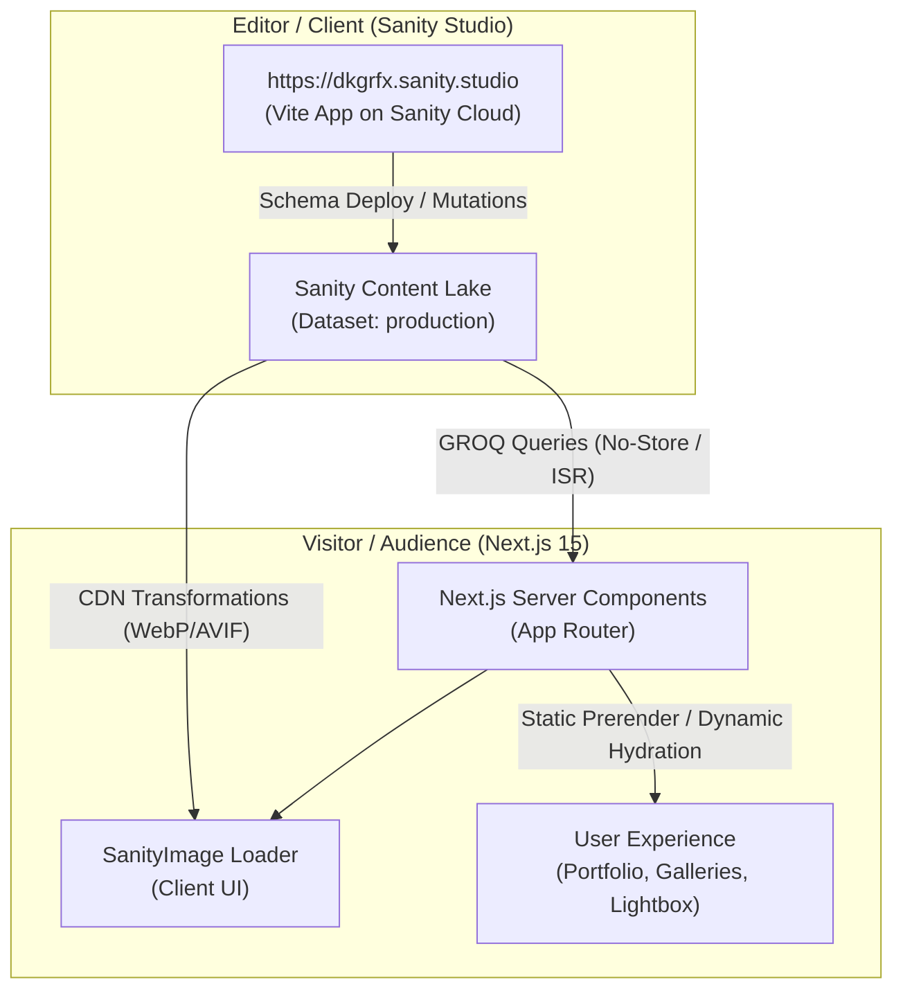

# Product Requirements Document (PRD)

## Project Name: DKGRFX Dynamic Portfolio & Content Management System
- **Client / Artist:** DKGRFX (Darwin)
- **Target Audience:** Commercial brands, athletic directors, tournament coordinators, families commissioning bespoke digital art, event attendees acquiring high-res photo moments.
- **Primary Domain:** [https://dkgrfx-portfolio.vercel.app](https://dkgrfx-portfolio.vercel.app)
- **CMS Endpoint:** [https://dkgrfx.sanity.studio](https://dkgrfx.sanity.studio)
- **Date Updated:** September 2026

---

## 1. Executive Summary & Objectives

### Problem Statement
The initial DK-Portfolio was a high-aesthetic, static Next.js landing page. The artist needed full autonomy to upload high-resolution sports photography, publish client event galleries, offer digital art commission case studies, and update service offerings without modifying source code or initiating code deployments.

### Strategic Goals
1. **Client Autonomy:** Non-technical editor experience to publish works in seconds via a modern, dark-mode Studio.
2. **Extreme Image Performance:** Maintain 95+ PageSpeed / Lighthouse performance on desktop and mobile by offloading image transformations (AVIF/WebP, hotspot focal point cropping, LQIP blur placeholders) to the Sanity Global CDN.
3. **Seamless WhatsApp Conversion:** Integrate dynamic WhatsApp pre-filled inquiry links tailored to each project, commission style, or service package.
4. **Resilient Data Architecture:** Hybrid Server-Side Fetching with fallback safeguards ensuring the site never appears blank or broken if datasets are fresh or offline.

---

## 2. Technical Architecture & System Design

### Architecture Specifications

1. **Standalone Studio vs. Embedded Next.js App:**
   - **Decision:** Standalone Studio in `studio-dk-landing/` deployed to `https://dkgrfx.sanity.studio`.
   - **Rationale:** Independent Vite build times (<1.5s), zero bloat on the Next.js bundle size, automatic headless updates without touching Next.js dependencies, and real-time TypeGen compatibility.

2. **Data Fetching Pattern:**
   - **Server Components:** Fetch published content asynchronously with `sanityFetch()` using GROQ queries and projection fragments (`imageFragment`).
   - **Client Components:** Receive clean serialized props and handle Framer Motion animations, interactive category filtering, Lightbox state, and image hover effects.
   - **Environment-Aware Caching:**
     - `Development:` `cache: "no-store"` + `useCdn: false` for instant local feedback upon pressing Publish.
     - `Production:` `revalidate: 60` (ISR) + Webhook tag revalidation (`/api/revalidate`) for sub-second CDN responses.

---

## 3. Data Models & Content Schemas

### 1. `heroSettings` (Singleton — Homepage Hero Banner)
- **Target Surface:** Homepage Hero Banner, Slideshow & Call to Actions.
- **Fields:**
  - `headline` (text: Main large title, e.g. "MAKE THE MOMENT\nFEEL BIGGER.")
  - `subheading` (string: Lead description)
  - `badge` (string: Monospace badge, e.g. "REAL MOMENTS → ART")
  - `categoryTags` (array of strings: e.g. ["ART", "DESIGN", "PHOTO"])
  - `primaryCtaText` (string: e.g. "EXPLORE THE WORK →")
  - `secondaryCtaText` (string: e.g. "SERVICES & COMMISSIONS")
  - `secondaryCtaLink` (string: e.g. "/services")
  - `footerTagline` (string: e.g. "ART • DESIGN • PHOTO — ONE CREATIVE IDENTITY")
  - `slides` (array of images with `hotspot: true`, `alt` string for continuous Ken Burns background carousel).

### 2. `creativeSignature` (Singleton — Photo to Art Process Showcase)
- **Target Surface:** Homepage "Creative Signature" process section.
- **Fields:**
  - `sectionLabel` (string: "Creative Signature")
  - `headingLine1` (string: "PHOTO → SKETCH →")
  - `headingLine2` (string: "FINAL ART")
  - `description` (text)
  - `step1` (object: badge, title, tagline, description, image)
  - `step2` (object: badge, title, tagline, description, image)
  - `step3` (object: badge, title, tagline, description, image)
  - `ctaText` (string: button label)
  - `ctaLink` (string: button destination)

### 3. `commissionsSettings` (Singleton — Custom Commissions & Process)
- **Target Surface:** Homepage "Commissions / Custom Art" section.
- **Fields:**
  - `sectionLabel` (string: "Custom Artwork & Illustration")
  - `headline` (string: "BRING YOUR VISION TO LIFE")
  - `description` (text: Process and style description)
  - `referencePhoto` (image with `hotspot: true`, `alt` string)
  - `referencePhotoLabel` (string: "ORIGINAL PHOTO")
  - `finalArtwork` (image with `hotspot: true`, `alt` string)
  - `finalArtworkLabel` (string: "VECTOR ILLUSTRATION")
  - `commissionInputs` (array of strings: pills of what can be commissioned)
  - `steps` (array of objects: number, label for the 4-step commissioning workflow)
  - `trustBadge` (string: "DIRECT WHATSAPP CONSULTATION • NO PLATFORM FEES • FULL PROCESS TRANSPARENCY")
  - `ctaText` (string: "START A COMMISSION")
  - `ctaSubject` (string: "Custom Art Commission")

### 4. `aboutSettings` (Singleton — Artist Bio, Manifesto & Stats)
- **Target Surfaces:** Homepage "About Darwin" Preview & `/about` Dedicated Page.
- **Fields:**
  - `previewWords` (array of strings: dynamic typographic words e.g. ["VISION", "MOMENTUM", "CRAFT", "IDENTITY", "STORY"])
  - `previewBadge` (string: "ABOUT THE ARTIST")
  - `previewBio` (text: Short summary bio for the homepage)
  - `fullBioHeading` (string: Main heading on `/about`)
  - `fullBioParagraphs` (array of text blocks: Artist story and manifesto)
  - `profileImage` (image with `hotspot: true`, `alt` string)
  - `actionImage` (image with `hotspot: true`, `alt` string: Darwin shooting/creating)
  - `stats` (array of objects: number, label e.g. 5+ Years, 50+ Projects, 100+ Prints)

### 5. `siteSettings` (Singleton — Global Contact & Socials)
- **Target Surfaces:** Global Footer, Contact Section (`#contact`), Contact Form, Meta.
- **Fields:**
  - `siteTitle` (string)
  - `artistName` (string: "Darwin")
  - `location` (string: "Atlanta, GA")
  - `whatsappNumber` (string: WhatsApp phone number with country code)
  - `contactEmail` (string: Direct contact email)
  - `instagramHandle` (string: e.g. "@dkgrfx")
  - `instagramUrl` (url: Instagram direct profile link)
  - `footerTagline` (string: e.g. "VISUAL STORYTELLING THROUGH PHOTOGRAPHY & ART")
  - `copyrightText` (string: "© DKGRFX. ALL RIGHTS RESERVED.")

### 6. `project` (Portfolio Works & Case Studies)
- **Target Surfaces:** Selected Work masonry on Homepage, `/work` portfolio grid, `/work/[slug]` bespoke project pages.
- **Fields:**
  - `title` (string, required)
  - `slug` (slug from title, required)
  - `category` (enum: 'art' | 'design' | 'photo', required)
  - `subcategory` (string, e.g. "Sports Action", "Streetwear", "Art Commission")
  - `description` (text, required)
  - `year` (regex `^\d{4}$`, default current year)
  - `coverImage` (image with `hotspot: true`, `alt` string required)
  - `images` (array of images with `hotspot: true`, `alt` string)
  - `tags` (array of strings, tag layout)
  - `isCaseStudy` (boolean)
  - `caseStudy` (object containing `summary` and `phases[]` with step titles, descriptions, and process images).

### 7. `practicePillar` (The Practice — Homepage Visual Pillars)
- **Target Surfaces:** Homepage "The Practice" 3-column banner cards.
- **Fields:**
  - `title` (string: "ART", "DESIGN", "PHOTO" or custom)
  - `category` (enum: 'art' | 'design' | 'photo')
  - `tagline` (string: e.g. "Sports · Campaigns · Branding")
  - `description` (text)
  - `image` (image with `hotspot: true`, `alt` string)
  - `orderRank` (number)

### 8. `service` (Services & Packages)
- **Target Surfaces:** `/services` catalog page.
- **Fields:**
  - `title` (string: e.g. "PHOTOGRAPHY", "GRAPHIC DESIGN", "CUSTOM ARTWORK")
  - `category` (enum: 'photo' | 'design' | 'art')
  - `description` (text)
  - `items` (array of strings for checklist features / offerings)
  - `cta` (string: button label, e.g. "BOOK DKGRFX", "START A PROJECT")
  - `ctaService` (string: pre-filled WhatsApp inquiry subject)
  - `orderRank` (number)

### 9. `printArtwork` (Art Prints & Merch — Own the Art)
- **Target Surfaces:** `/services` page "Own the Art" print gallery.
- **Fields:**
  - `title` (string: Product / Artwork Title)
  - `slug` (slug)
  - `badge` (string: e.g. "ART PRINT", "POSTER", "STICKER PACK")
  - `image` (image with `hotspot: true`, `alt` string)
  - `sizes` (array of strings: e.g. `8" × 10"`, `11" × 14"`, `16" × 20"`)
  - `description` (text)
  - `productType` (enum: 'print' | 'poster' | 'sticker' | 'merch')
  - `tags` (array of strings)
  - `orderRank` (number)

### 10. `galleryEvent` (Client Event Photo Albums)
- **Target Surfaces:** Event Highlights on Homepage, `/events` list, `/events/[slug]` full photo album.
- **Fields:**
  - `title` (string, required)
  - `slug` (slug from title, required)
  - `date` (date string: YYYY-MM-DD, ordered descending)
  - `location` (string: default "Atlanta, GA")
  - `description` (text)
  - `coverImage` (image with `hotspot: true`, `alt` string)
  - `photos` (array of images with `hotspot: true`, `alt` string)

---

## 4. UI/UX Specifications

### Interactive Features
1. **Masonry Showcase:** Organically balanced aspect ratios (`aspect-[16/11]`, `aspect-[3/4]`, `aspect-[4/5]`) with dark ambient gradients and category badges.
2. **Category Filtering (`/work`):** Client-side instant filter with `AnimatePresence` and smooth entry/exit transitions across ALL, ART, DESIGN, and PHOTO categories.
3. **Interactive Before / After Slider:** High-precision touch and drag slider for Art Commissions comparing original reference photographs with finalized freehand vector illustrations.
4. **Sports Action Gallery & Lightbox:** High-shutter speed photography showcase with camera EXIF telemetry (1/2000s, f/2.8, ISO, focal length) and full-screen lightbox navigation with keyboard controls (Arrow keys, Escape).
5. **Direct WhatsApp Conversion:** Floating and in-section CTA buttons automatically encoding tailored inquiry messages for instant mobile communication.

---

## 5. Security, Roles & Access Control

1. **Authentication:** Managed through Sanity Cloud Auth (Google OAuth & Email Magic Links).
2. **Access Roles:**
   - **Administrator (Developer):** Full schema, billing, dataset, and API token control.
   - **Editor (Client):** Document creation, photo upload, hotspot editing, and publishing. Restricted from technical configuration or destructive project settings.
3. **CORS Whitelist:**
   - `http://localhost:3000` (Dev)
   - `https://dkgrfx-portfolio.vercel.app` (Production)
   - `https://dkgrfx.sanity.studio` (Studio)
